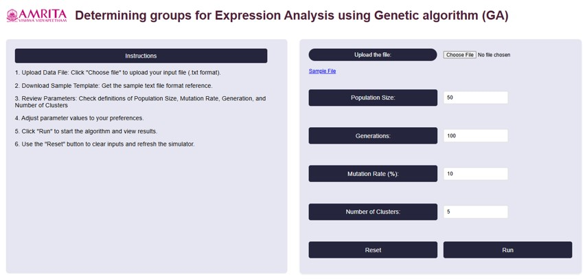
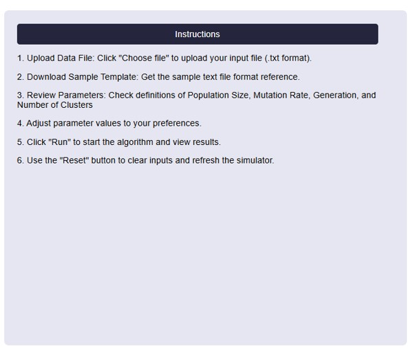
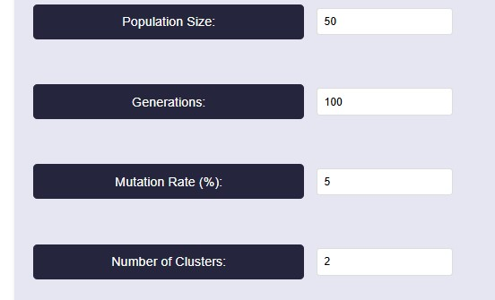
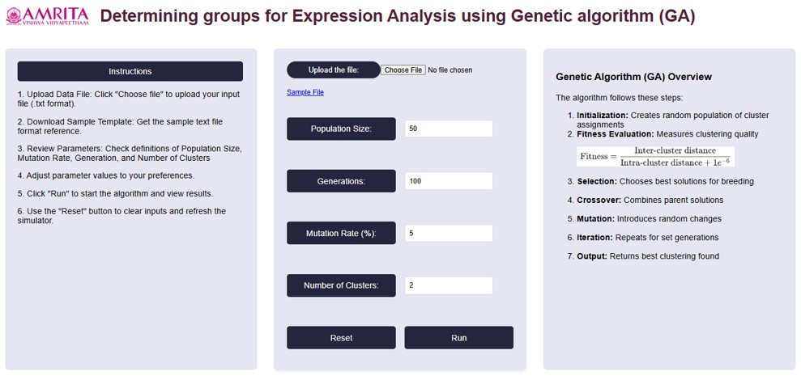
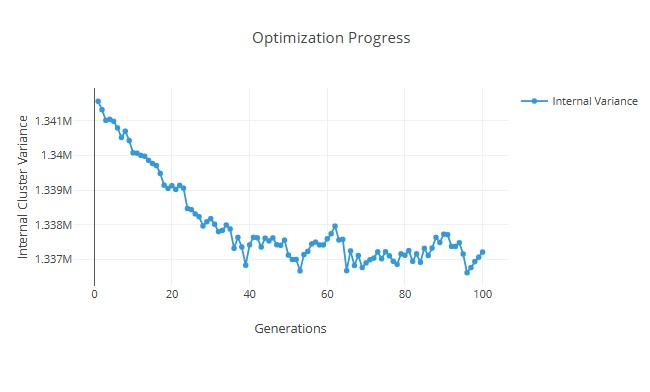
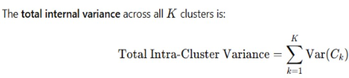
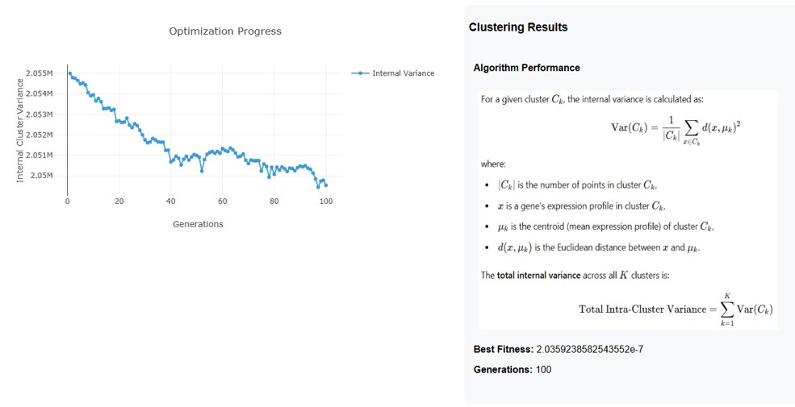
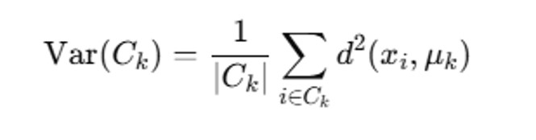
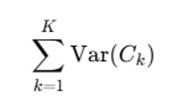

### Procedure

1. Users can open the simulator tab, where the Graphical User interface (GUI) are provided with different options for running the experiment as shown below.

&nbsp;

•	On the left side of the page, Instructions to perform the simulator were provided.

&nbsp;

&nbsp;

2. To begin, upload a gene expression dataset, Click on the “Choose File” button to select your file. If we don’t have a file, can download a sample file (Gene Expression Omnibus (GEO) database) that provided in the GUI by clicking "Sample File".

&nbsp;

&nbsp;

3. For running the algorithm, set the parameters based on our needs. The parameters are population size, Generations, Mutation Rate (%) and Number of clusters. For reference, we have taken the values as shown in below figure.

&nbsp;

&nbsp;

### Parameter Explanation

•	Population Size: This determines how many possible solutions (clusters) the algorithm considers in each generation. Here we take 50- A higher value increases diversity but takes more time to compute.

•	Generations: 100-The algorithm runs for 100 iterations, meaning it refines the clustering solution over multiple steps. 

•	 Mutation Rate: 5%- A mutation rate of 5% means that in each generation, 5% of the individuals (solutions) undergo random changes. Mutation helps prevent premature convergence by introducing diversity, ensuring the algorithm doesn’t get stuck in a local minimum.

•	Number of Clusters: 2-The dataset is being divided into two clusters. This means the clustering algorithm aims to find the best way to group data points into two distinct categories.

&nbsp;

4. After setting the parameters, click on the “Run button. The algorithm will start clustering the gene expression data. We can see the Optimization Progress Graph and clustering results displayed on the right side of the GUI.

•	Algorithm steps were also provided in the right side of the GUI platform for better understanding.

&nbsp;

&nbsp;

5. With the provided parameter values, we can get an internal variance graph as shown below:

&nbsp;

&nbsp;

6. User can get the clustering results from total internal variance using the equation:

&nbsp;

&nbsp;

&nbsp;

### Interpretation of Results

#### 1. Optimization Progress (Graph)

• The y-axis represents the Internal Cluster Variance (how well the clusters are formed).

• The x-axis represents the Generations (iterations of the optimization algorithm).

• The trend shows a decreasing variance over generations, indicating that the clustering algorithm is progressively improving the compactness of clusters.

• The initial variance is high, but as the optimization progresses, it gradually decreases with some fluctuations, showing improvement in clustering.

&nbsp;

#### 2. Clustering Results

• Formula for Internal Variance:

The variance for a given cluster Ck is calculated as:

&nbsp;

&nbsp;

•	∣Ck∣ is the number of points in cluster Ck

•	xi is a gene’s expression profile in Ck.

•	μk is the centroid (mean expression profile).

•	d (xi, μk) is the Euclidean distance between the point and the cluster centroid.

Total Variance Across Clusters:

&nbsp;

&nbsp;

This represents the overall clustering quality: Lower Variance= Better clustering

&nbsp;

#### 3. Final Performance Metrics

• Best Fitness: 2.0359238582543552e-7- This indicates how well the clustering solution has minimized the internal variance.

• Generations: 100-The optimization process ran for 100 iterations to refine the clusters.

&nbsp;

### Overall Output Interpretation

• The optimization algorithm has successfully reduced the internal variance, meaning clusters became more compact.

• The fluctuations in variance suggest that there was some instability in certain iterations, but the general trend is downward.

• The final best fitness value is very small, indicating a well-optimized clustering structure.

