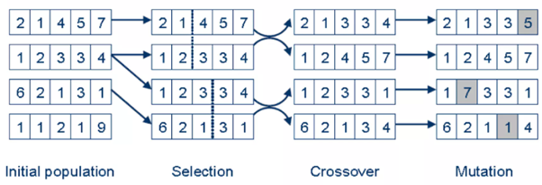
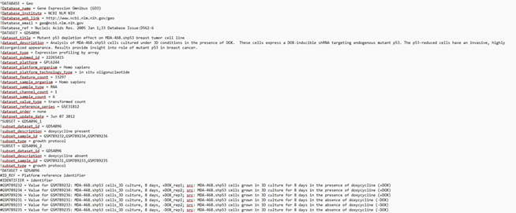

### Theory

In modern genomics research, gene expression analysis is essential for deciphering the functional roles of genes and their interactions in biological systems.ie It helps to understanding how genes are regulated, how they interact, and how their expression patterns correlate with various biological conditions. Measuring and analysing gene expression is important, as the level of expression of a particular gene within a cell can provide large amounts of information. various gene expression analysis methods have been used including serial analysis of gene expression (SAGE), microarrays, and RNA sequencing (RNA-Seq) allowing research to identify large datasets and genes that are differentially expressed under different conditions like disease states or experimental treatment. 

&nbsp;

#### Serial Analysis of Gene Expression (SAGE) 

Serial Analysis of Gene Expression is a high-throughput technique based on the principle of extracting short sequence tags (typically 10–14 base pairs) from mRNA transcripts, linking them together into longer DNA molecules, and sequencing them to quantify gene expression. This method allows for the digital representation of transcript abundance without requiring prior knowledge of gene sequences, making it particularly useful for discovering novel genes and studying differential gene expression. SAGE has been widely applied in cancer research, neuroscience, and developmental biology to analyse gene expression patterns under different physiological and pathological conditions. However, due to its labour-intensive nature and advancements in sequencing technologies, it has largely been replaced by RNA sequencing (RNA-Seq)

&nbsp;

#### Microarrays

Microarrays are hybridization-based gene expression analysis tools that operate on the principle of complementary base pairing. In this method, fluorescently labelled cDNA or RNA samples are hybridized to thousands of pre-designed oligonucleotide probes immobilized on a solid surface, such as a glass slide or silicon chip. The intensity of fluorescence signals corresponds to the expression levels of specific genes, allowing for the simultaneous measurement of gene expression across a large number of genes. Microarrays have been widely applied in biomedical research, including cancer classification, disease diagnostics, drug response studies, and functional genomics. While they provide a cost-effective approach for gene expression profiling, their reliance on known sequences and limited dynamic range make them less versatile compared to next-generation sequencing methods like RNA-Seq.

&nbsp;

#### RNA Sequencing (RNA-Seq) 

RNA Sequencing is a next-generation sequencing (NGS) technique based on the principle of converting RNA molecules into complementary DNA (cDNA), which is then fragmented, sequenced, and computationally reconstructed to analyze gene expression. Unlike hybridization-based methods, RNA-Seq directly sequences the transcriptome, allowing for the precise quantification of gene expression levels, detection of novel transcripts, alternative splicing events, and non-coding RNAs. Its high sensitivity and broad dynamic range make it the gold standard for transcriptomic studies. RNA-Seq has been widely applied in biomedical research, including disease biomarker discovery, cancer transcriptomics, neurodegenerative disease studies, and personalized medicine. However, the method requires advanced bioinformatics analysis and can be more expensive than microarray-based approaches.

In bioinformatics, gene expression analysis referred to a computational method that allows to study how actively genes are being transcribed into RNA. By analysing gene expression profiles, scientists can classify genes into functional groups, identify biomarkers for diseases, and uncover the molecular mechanisms underlying health and disease. However, gene expression data is often high-dimensional, noisy, and complex, making it more complex to determine meaningful groups of genes or samples. One of the key challenges in this method is the effective grouping of genes or samples based on their expression profiles. Traditional clustering and classification techniques, such as hierarchical clustering, K-means, and principal component analysis (PCA), often struggle to efficiently handle the large volume of data and may fail to capture intricate biological relationships. This has led to the adoption of machine learning and evolutionary computing techniques, particularly Genetic Algorithms (GAs), to optimize the grouping of genes based on their expression profiles.

&nbsp;

## Genetic Algorithms (GAs)

Genetic Algorithms provide a powerful, adaptive approach to clustering and feature selection in gene expression analysis. It was first developed by John Henry Holland, and he published the studies related to genetic algorithms in his book “Adaptation in Natural and Artificial Systems” in 1975. GA provides an evolutionary approach to optimize gene grouping by mimicking the natural selection process proposed by Charles Darwin. Adapting to the principles of natural evolution, GAs simulate processes such as selection, crossover, and mutation to refine solutions for grouping genes or samples. That means it’s a type of local search that mimics evolution by taking a population of strings which encode possible solutions and combines them based on a fitness function to produce individuals that are more fit.

&nbsp;

### Core Components of Genetic Algorithm (GA)

#### Population: 

The population is a collection of candidate solutions (chromosomes)that undergo evolution over several generations. A chromosome is a potential solution to the problem being addressed. For example, in gene expression analysis, a chromosome may represent a particular grouping of genes according to their expression profiles, where each gene is mapped to a group (e.g., [0,1,2] for three groups).

&nbsp;

#### Chromosome Representation: 

The representation of a chromosome varies based on the problem domain. Typical representations are binary strings, real-valued vectors, and permutation-based encodings. In gene expression clustering, a chromosome can be represented as a vector where each component is a gene and its corresponding cluster (e.g., [1,2,1,3,2] meaning genes are in different clusters).

&nbsp;

#### Fitness Function: 

The fitness function assesses how well a chromosome is solving the problem. In clustering tasks, the fitness function can be set to maximize intra-cluster similarity (genes within the same cluster should share similar expression patterns) and minimize inter-cluster similarity. A potential measure would be the silhouette score, which measures clustering quality by comparing how similar a gene is to its own cluster versus other clusters.

&nbsp;

#### Selection: 

Individuals with high fitness are chosen to transmit their genetic information to the next generation so that highly performing solutions contribute to future generations. Selection methods include tournament selection, where the best individual from a random subset is chosen, and roulette wheel selection, where the probability of selection is proportional to fitness. Other sophisticated methods like rank selection, simulated annealing and elitism were also used for selection process. like For example, in gene clustering, genes grouped more accurately in biologically meaningful clusters may have a higher chance of being selected.

&nbsp;

#### Crossover: 

Crossover combines genetic material from two parent chromosomes to generate offspring, introducing genetic diversity. Common methods include single-point crossover, where a random crossover point is selected, and segments are swapped between parents. For example, in gene clustering, if two parents represent different clustering solutions, crossover might combine cluster assignments from each parent, potentially forming a better grouping of genes.

&nbsp;

#### Mutation: 

Mutation introduces small random changes in the chromosome to maintain diversity and prevent premature convergence. In gene expression clustering, mutation might involve randomly changing a gene’s cluster assignment (e.g., flipping an assignment from cluster 1 to cluster 2), helping the algorithm explore different grouping possibilities and avoid local optima (Fig.1).

&nbsp;

Fig.1: Representation of Basic Genetic Algorithm steps 

Adapted from: https://www.slideshare.net/slideshow/genetic-algorithms-12793533/12793533?from_search=1

&nbsp;

Unlike other conventional clustering methods that rely on predefined parameters, Genetic Algorithms provide an efficient, adaptive, and robust method for clustering gene expression data .GA-based techniques explore a broader search space and can dynamically optimize grouping criteria, making them highly suitable for complex biological datasets. By applying an appropriate fitness function, GA ensures that gene groups are formed based on biologically meaningful patterns, maximizing intra-group similarity while ensuring inter-group distinctiveness. This approach has proven valuable in various biomedical applications, including cancer classification, biomarker discovery, and personalized medicine, where precise gene expression analysis is crucial for disease diagnostics and therapeutic advancements.

&nbsp;

### Gene Expression data 

 Gene expression data typically appears as a matrix where rows represent genes and columns represent samples or conditions. Mostly the data from public repositories like the GEO database can be used or generated synthetically. In this context, the Genetic Algorithm is applied to group either genes or samples and are ideal for exploring complex clustering in gene expression data. 

In gene expression analysis, grouping approaches help researchers interpret high-dimensional data by identifying patterns either among genes or among biological samples. Gene-wise clustering focuses on grouping genes that exhibit similar expression patterns across all samples. This method is particularly useful for detecting co-expressed or functionally related genes, as such patterns often indicate shared biological roles or regulatory mechanisms. For example, genes consistently upregulated in response to a stimulus may be part of the same pathway or controlled by the same transcription factor. Gene-wise clustering is often used in studies aiming to uncover functional gene modules, identify targets for further investigation, or construct gene co-expression networks

In contrast, sample-wise clustering aims to group samples based on the overall expression profiles across all genes. This approach is valuable for identifying phenotypically or biologically similar samples, such as distinguishing between healthy and diseased tissue, treatment responders and non-responders, or different developmental stages. By clustering samples with similar transcriptomic profiles, researchers can uncover hidden subgroups, validate experimental design, or even discover new disease subtypes. In the current simulation, the emphasis is on sample-wise grouping, where a Genetic Algorithm is employed to optimize the partitioning of samples based on minimized internal variance and maximized inter-group distinction.

&nbsp;

Given an example of Sample gene expression data in FASTA format, obtained from GEO database

&nbsp;

This file is a gene expression dataset downloaded from the NCBI Gene Expression Omnibus (GEO), specifically Dataset GDS4096, containing data on the effect of mutant p53 depletion in the MDA-468.shp53 breast tumor cell line under 3D culture conditions.

#### Interpretation of Sample Data
##### I.	Biological Context
•	**Experiment Focus:** The study investigates how depleting mutant p53 (via DOX-inducible shRNA) affects gene expression in MDA-468.shp53 cells.

&nbsp;&nbsp; +DOX: Mutant p53 is knocked down

&nbsp;&nbsp; –DOX: Control condition (no p53 depletion)

•	**Organism:** Homo sapiens

•	**Platform ID:** GPL6244 (Affymetrix Human Gene 1.0 ST Array)

•	**Sample Type:** RNA

•	**Samples:** 6 in total

&nbsp;&nbsp; 3 treated with doxycycline (+DOX) → GSM789232, GSM789234, GSM789236

&nbsp;&nbsp; 3 untreated (–DOX) → GSM789231, GSM789233, GSM789235

&nbsp;

##### II.	Data Structure
•	Columns:

&nbsp;&nbsp; **ID_REF:** Probe or gene ID

&nbsp;&nbsp; **IDENTIFIER:** Gene symbol or chromosome location

&nbsp;&nbsp; **GSM:** Expression values for each sample (log-transformed)

&nbsp;

•	Values:

&nbsp;&nbsp; Numerical entries represent gene expression intensities.

&nbsp;&nbsp; null indicates missing or unmeasured values for a particular gene in that sample.

&nbsp;

##### III.	Subset Definitions

Two subsets are explicitly defined:

&nbsp;&nbsp; GDS4096_1 (DOX present): Treated group with mutant p53 knockdown.

&nbsp;&nbsp;GDS4096_2 (DOX absent): Untreated control group.

These subsets help in comparative analysis (e.g., differential gene expression, clustering, heatmaps).

&nbsp;

##### IV.	Example Genes with Expression Data

This suggests that PINK1 and TP73 could be responsive to mutant p53 knockdown.
